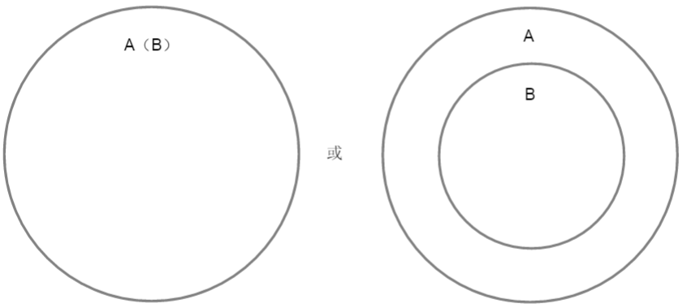
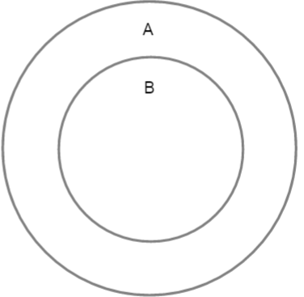
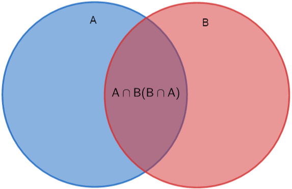
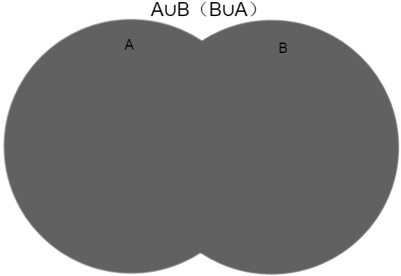
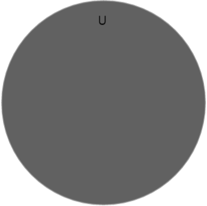
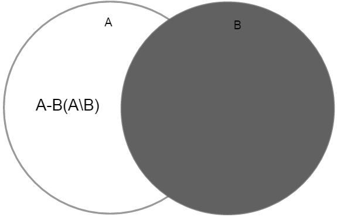
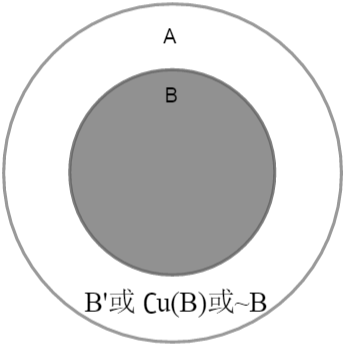

# 集合

### 集合元素

集合：具有某种特定性质的具体的或抽象的对象汇总而成的集体。

元素：构成集合的所有对象。

### 子集

集合 $A$ 中包含集合 $B$ 中所有的元素，则集合 $B$ 就是集合 $A$ 的子集。
$$
B\subseteq A
$$

### 真子集

集合 $B$ 是集合 $A$ 的子集，但在集合 $A$ 中存在不属于集合 $B$ 的元素，则集合 $B$ 是集合 $A$ 的真子集。
$$
B\subsetneq{A}
$$

### 空集

集合中不包含任何元素，称之为空集。

空集特点：

1. 空集是任意一个非空集合的真子集。
2. 空集是任何一个集合的子集 。

$$
\phi
$$

### 交集

集合 $A$ 和集合 $B$ 共有的元素组成的集合，称之为交集，记作 $A∩B$（或 $B∩A$），读作 $A交B$（或 $B交A$）。
$$
A∩B（B∩A）
$$

### 并集

集合 $A$ 和集合 $B$ 中所有元素组成的集合，称之为并集，记作 $A∪B$（或 $B∪A$），读作 $A并B$（或 $B并A$）。

并集特点：

1. 并集只是是两个集合的总和。

$$
A∪B（B∪A）
$$

### 全集

全集特点：

1. 全集是总的一个集合，看取值范围而言。

### 差集

属于集合 $A$ 而不属于集合 $B$ 的元素组成的集合，称之为差集，记作 $A-B$ 或 $A\backslash{B}$ 。

差集特点：

1. 差集也可以叫做相对补集。
2. 一个集合不能是另一个集合的子集。

### 补集

属于集合 $A$ 而不属于集合 $B$ 的元素组成的集合，称之为 $B$ 的补集，记作 $B'$ 或 $∁u（B）$ 或 $\sim{B}$ 。

补集特点：

1. 补集一般指的是绝对补集。
2. 一个集合是另一个集合的子集。

### 集合符号

|    符号     |  含义  |     符号     |   含义   |
| :---------: | :----: | :----------: | :------: |
|    $\in$    |  属于  |   $\notin$   |  不属于  |
| $\subseteq$ | 包含于 | $\subsetneq$ | 真包含于 |
| $\supseteq$ |  包含  | $\supsetneq$ |  真包含  |
|   $\phi$    |  空集  |     $=$      | 集合相等 |
|   $\cap$    |  交集  |    $\cup$    |   并集   |
|     $U$     |  全集  |   $C_{U}$    |   补集   |

