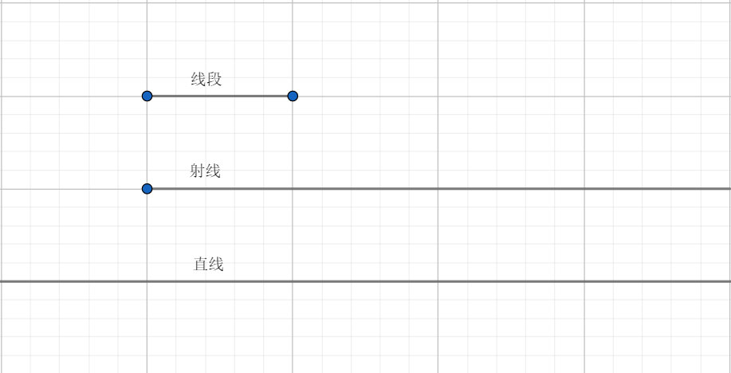
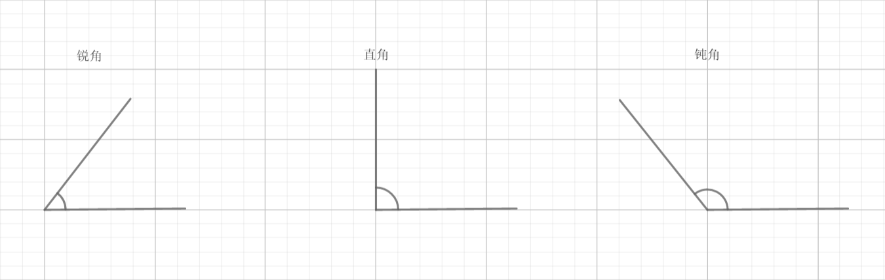
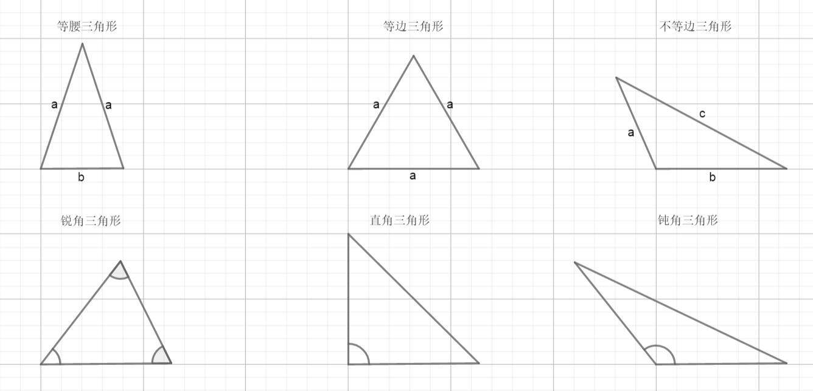
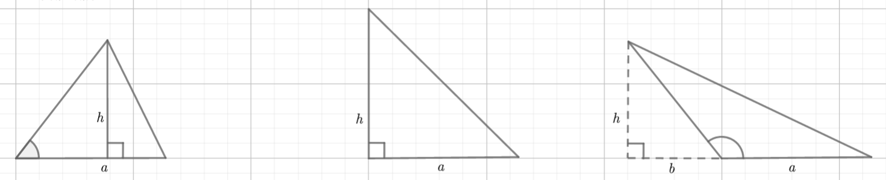

# 几何

### 点线面

**点**

1. 点是最简单的形，是几何图形最基本的组成部分。

2. 点在空间中只有位置，没有大小的图形。

3. 点是无法被定义的。

**线**

1. 线是由无数的点组成。

2. 线分为直线和曲线。 

3. 直线又分为线段、射线与直线。

4. ①线段：两端都被固定，有固定的长度，无法延伸。

   ②射线：一端被固定，另一端可以无限延伸。

   ③直线：可以向两端无限延伸。

5. 直线公理：

   ①过任意两点有且只有一条直线。

   ②平行于同一条直线的两条直线互相平行。

**面**

1. 面是由无数的直线组成的。

2. 面分为平面和曲面。

3. 平面公理

   - 经过不在一条直线上的三点，有且只有一个平面。
   - 经过一条直线和直线外的一点，有且只有一个平面。
   - 经过两条平行直线或两条相交直线，有且只有一个平面。
   - 两个不重合不平行的平面，有且只有一条交线。
4. 位置判定

   线与面：

   - 一条直线垂直于一个平面，则这条直线垂直于这个平面内的所有直线。
   - 一条直线与一个平面内的两条相交直线都垂直，则该直线与平面垂直。   
   - 垂直于同一条直线的两个平面平行。
   - 一条直线上的任意两点在一个平面内，那么这条直线在此平面内。
   
   - 平面外的一条直线与平面内的一条直线平行，则该直线与此平面平行。
   - 两个平行平面同时与第三个平面相交，那么它们的交线平行。
   - 一条直线垂直于一个平面，那么与这条直线平行的直线垂直于该平面。
   - 垂直同一个平面的两条直线平行。
   - 两个平行平面内的任意直线都与另一平面平行。
   
   面与面：
   
   - 两个平面没有公共线，那么两个平面平行。
   - 两个平面有一条公共线，那么两个平面相交。
   - 一个平面内有两条相交直线都平行于另一个平面，那么两个平面平行。
   - 一个平面过另一个平面的垂线，则这两个平面垂直。
   - 两个平面垂直，则一个平面内垂直于交线的直线与另一个平面垂直。

### 角

角：两条有公共端点的射线组成的几何对象。

角度分为：锐角、直角、钝角。

1. 锐角：小于90°的角。
2. 直角：等于90°的角。
3. 钝角：大于90°的角。

### 平面多边形

**多边形与角度**

三角形（三边形）角度之和是：180°

四角形（四边形）角度之和是：360°

五角形（五边形）角度之和是：540°

...

每个封闭且以直线为边的多边形，其角度的总和是确定的，这是因为相比三角形每多出一条边，就可以将该多边形多划分出一个三角形，其总角度就多增加180°。

由此可推断出多变形的边数与总角度的关系式：
$$
总角度=（边数-2）*180°
$$
**三角形**

三角形分为：锐角三角形、直角三角形、钝角三角形、等腰三角形、等边三角形、不等边三角形。

1. 锐角三角形：三个角都是锐角的三角形
2. 直角三角形：有一个角是直角的三角形。
3. 钝角三角形：有一个角是钝角的三角形。
4. 等腰三角形：有两条边是等长的三角形。
5. 等边三角形：三条边都是等长的三角形。
6. 不等边三角形：三条变都不是等长的三角形。

**三角形面积**

三角形面积运算公式：

$S$：面积	$a$：底边	$b$：底边距外部垂线的距离	$h$：垂线高度

注意：垂线在三角形内部时，$b$ 值为0。
$$
S=\frac{1}{2}(a-b)h
$$
**四边形**

四边形分为：平行四边形、长方形、正方形、菱形、梯形。

梯形分为：直角梯形、等腰梯形。

